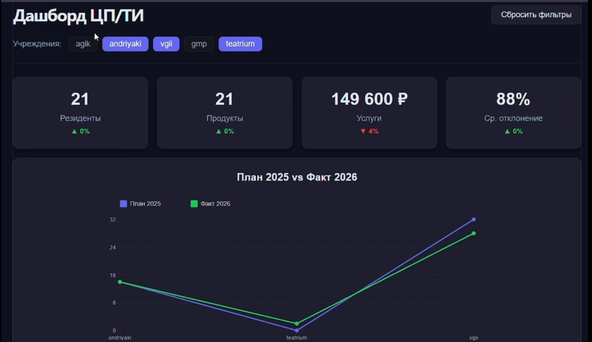

# Digital — Система аналитики Big Data для учреждений культуры

Веб-дашборд для анализа деятельности 5 организаций культуры на основе их квартальных Excel-отчётов.

---

## 🎯 Что делает проект

Собирает данные от 5 организаций:
- **АГИК** — Алтайский государственный институт культуры
- **ВГИИ** — Воронежский государственный институт искусств
- **ГМП** — Музыкально-педагогический институт им. Ипполитова-Иванова
- **Андрияки** — Академия акварели Сергея Андрияки
- **ТЕАТРИУМ** — Пермское хореографическое училище

Превращает 20 Excel-листов в **130 показателей**, считает статистику по группе и кластеризует организации, отдаёт аналитику через API, показывает в тёмном дашборде с фиолетовым акцентом.

---

## 📁 Структура проекта

```
Digital/
├── README.md                          ← этот файл
├── requirements.txt                   ← все зависимости Python
├── .venv/                             ← виртуальное окружение (в .gitignore)
│
├── Backend/
│   └── agik_project/                  ← данные + парсеры
│       ├── parse_reports.py           ← xlsx → parquet
│       ├── aggregates.py              ← + среднее, z-score, кластеры
│       ├── validate.py                ← проверка целостности
│       ├── check.py                   ← отладочный
│       ├── README.md                  ← подробно по роли Data Engineer
│       │
│       ├── data/
│       │   ├── raw/                   ← 5 xlsx (не коммитится)
│       │   │   ├── АГИК.xlsx
│       │   │   ├── ВГИИ.xlsx
│       │   │   ├── гмп.xlsx
│       │   │   ├── Андрияки.xlsx
│       │   │   └── театриум.xlsx
│       │   │
│       │   └── clean/                 ← результат (идёт в git)
│       │       ├── institutions.parquet / .csv
│       │       ├── indicators.parquet   / .csv
│       │       ├── aggregates.parquet   / .csv
│       │       ├── clusters.parquet     / .csv
│       │       ├── schema.json
│       │       └── validation_report.json
│       │
│       └── api/                       ← FastAPI-бэкенд
│           ├── main.py                ← точка входа
│           ├── data_store.py          ← загрузка parquet при старте
│           ├── services.py            ← математика
│           └── routers/
│               ├── system.py          ← /health, /meta, /institutions, /clusters
│               └── analytics.py       ← /overview, /dynamics, /top, /heatmap, /table
│
└── frontend/                          ← React + Vite
    ├── package.json
    ├── vite.config.js
    ├── index.html
    └── src/
        ├── main.jsx
        ├── App.jsx                    ← финальный layout
        ├── App.css
        ├── api/
        │   ├── client.js              ← обёртка над fetch
        │   └── hooks.js               ← useOverview, useDynamics и др.
        ├── context/
        │   └── FiltersContext.jsx     ← выбранные учреждения
        ├── components/
        │   ├── Header.jsx             ← шапка с чипами-фильтрами
        │   ├── KpiCards.jsx
        │   ├── DynamicsChart.jsx      ← линия (SVG)
        │   ├── TopEvents.jsx          ← столбики (CSS)
        │   ├── AgePie.jsx             ← пирог (SVG + conic-gradient)
        │   ├── Heatmap.jsx            ← теплокарта (CSS-grid)
        │   ├── DataTable.jsx
        │   ├── Clusters.jsx
        │   └── Recommendations.jsx
        └── styles/
            ├── theme.css              ← CSS-переменные
            └── global.css             ← сброс
```

---

## 🚀 Как запустить проект с нуля

### Шаг 1. Проверить, что установлено

```bash
node --version        # нужен 20+
npm --version
py --version          # нужен 3.10+
git --version
```

Если чего-то нет — установить:
- **Node.js**: https://nodejs.org (LTS)
- **Python 3.11**: https://www.python.org/downloads/ (галочка «Add to PATH»)
- **Git**: https://git-scm.com

---

### Шаг 2. Клонировать репозиторий

```bash
git clone https://github.com/nutpiks/Digital.git
cd Digital
```

---

### Шаг 3. Создать виртуальное окружение Python

```bash
py -m venv .venv
```

Активировать:

**Windows (PowerShell):**
```powershell
Set-ExecutionPolicy -Scope Process -ExecutionPolicy Bypass
.\.venv\Scripts\Activate.ps1
```

**Windows (CMD):**
```cmd
.venv\Scripts\activate.bat
```

**macOS / Linux:**
```bash
source .venv/bin/activate
```

Появится `(.venv)` в начале строки.

---

### Шаг 4. Установить Python-зависимости

```bash
pip install -r requirements.txt
```

Если интернет медленный:
```bash
pip install --default-timeout=1000 -r requirements.txt
```

---

### Шаг 5. Собрать чистые данные

```bash
cd Backend\agik_project

py parse_reports.py     # xlsx → indicators + institutions
py aggregates.py        # + group_mean, z_score, кластеры
py validate.py          # проверка, пишет validation_report.json
```

**Ожидаемый вывод:**
```
OK institutions: 5
OK indicators: 130
OK aggregates: 130 строк
OK clusters:   5 учреждений
ERRORS: нет
WARNINGS: N
```

Вернуться в корень:
```bash
cd ..\..
```

---

### Шаг 6. Запустить бэкенд (первый терминал)

```bash
cd Backend\agik_project\api
uvicorn main:app --reload
```

**Ожидаемый вывод:**
```
INFO:     Uvicorn running on http://127.0.0.1:8000
INFO:     Started server process [XXXX]
INFO:     Waiting for application startup.
Загрузка DataStore...
DataStore: aggregates=130, institutions=5, clusters=5
INFO:     Application startup complete.
```

**Не закрывай этот терминал.**

---

### Шаг 7. Установить зависимости фронта

Открой **второй терминал** (Ctrl + Shift + ` в VS Code):

```bash
cd frontend
npm install
```

Если медленно:
```bash
npm install --fetch-timeout=600000 --registry=https://registry.npmmirror.com
```

---

### Шаг 8. Запустить фронт (второй терминал)

```bash
npm run dev
```

**Ожидаемый вывод:**
```
VITE v8.x.x  ready in XXX ms
➜  Local:   http://localhost:5173/
```

---

### Шаг 9. Открыть в браузере

| Что | Адрес |
|---|---|
| **Дашборд** | http://localhost:5173/ |
| **API-документация (Swagger)** | http://127.0.0.1:8000/docs |

---

## 🎯 Что должно работать

### На фронте (`http://localhost:5173/`)
- Шапка с заголовком и 5 чипами-фильтрами (`agik`, `vgii`, `gmp`, `andriyaki`, `teatrium`)
- **KPI-карточки**: Резиденты, Продукты, Услуги, Ср. отклонение
- **Линейный график** план 2025 vs факт 2026
- **Столбики** топ-10 показателей
- **Пирог** разбивка по формам
- **Тепловая карта** учреждение × показатель
- **Таблица** 130 строк с сортировкой, поиском, пагинацией
- **Кластеры** (cluster_A / cluster_B)
- **Рекомендации** (что подтянуть)

**Клик по чипу** → все блоки пересчитываются.

### В Swagger (`http://127.0.0.1:8000/docs`)
Проверить 4 роута:

| Роут | Что должно быть |
|---|---|
| `GET /health` | `{"status":"ok","loaded":true}` |
| `GET /institutions` | 5 организаций |
| `GET /overview` | KPI с числами |
| `GET /clusters` | 5 записей с cluster_A/cluster_B |

---

## 🔧 Полезные команды

### Остановить сервер
В терминале, где он запущен: **Ctrl + C**

### Перезапустить бэкенд
```
cd Backend\agik_project\api
uvicorn main:app --reload
```

### Перезапустить фронт
```
cd frontend
npm run dev
```

### Пересобрать данные (если изменились xlsx)
```
cd Backend\agik_project
py parse_reports.py && py aggregates.py && py validate.py
```
Затем **перезапустить бэкенд** — он подхватит новые parquet.

### Выйти из venv
```
deactivate
```

---

## ⚠️ Известные проблемы и решения

### `Set-ExecutionPolicy` при активации venv
```powershell
Set-ExecutionPolicy -Scope Process -ExecutionPolicy Bypass
```
→ Y → Enter. Потом снова активировать venv.

### `pip` не находится
Значит venv не активирован. Проверь `(.venv)` в начале строки.

### `npm error ENOENT: package.json`
Ты не в папке `frontend`. Сделай `cd frontend`.

### `recharts` не ставится
Не нужен — все графики написаны **на чистом SVG / CSS**. Никаких внешних зависимостей.

### `ModuleNotFoundError: No module named 'pyarrow'`
```bash
pip install pyarrow
```

### API возвращает 500 (NaN не сериализуется)
Значит parquet содержит NaN. Решение: в `services.py` уже есть `clean_records()` — все роуты возвращают чистые JSON.

### Фронт показывает «Нет данных»
- Проверь, что **бэкенд работает** — открой `http://127.0.0.1:8000/health`
- Проверь **консоль браузера** (F12 → Console) — есть красные ошибки?
- Проверь **Network** (F12 → Network) — запросы к API идут?

---

## 📦 Технологии

| Слой | Технология |
|---|---|
| **Данные** | Python 3.10+, pandas, numpy, openpyxl, pyarrow |
| **Backend** | FastAPI, uvicorn, pydantic |
| **Frontend** | React 19, Vite 8, CSS Modules |
| **Формат данных** | parquet (для машин), csv (для людей) |
| **Алгоритмы** | k-means, z-score, groupby-агрегации |

---

## 🤝 Роли в проекте

| Роль | Что делает | Папка |
|---|---|---|
| **1. Дизайнер** | Макеты Figma, палитра, состояния | — |
| **2. Data Engineer** | xlsx → чистые parquet | `Backend/agik_project/` |
| **3. Backend** | FastAPI, JSON-роуты | `Backend/agik_project/api/` |
| **4. Frontend — каркас** | FiltersContext, API-хуки, роутинг | `frontend/src/` |
| **5. Frontend — визуализация** | 6 блоков + кластеры + рекомендации | `frontend/src/components/` |

---

## 📊 Данные

- **5 организаций**
- **130 показателей** (26 × 5)
- **3 формы** отчёта: form1, appendix_f1, form2
- **Период:** 2025 (план) → 2026 (факт)
- **2 кластера** организаций

---

## 🎯 Что можно построить на этих данных

| Блок ТЗ | Реализовано | Роут |
|---|---|---|
| Несколько учреждений | ✅ 5 организаций | `/institutions` |
| KPI-карточки | ✅ 4 карточки | `/overview` |
| Динамика | ✅ план vs факт | `/dynamics` |
| Сравнение | ✅ топ + breakdown | `/top`, `/breakdown` |
| Кластеризация | ✅ k-means, 2 кластера | `/clusters` |
| Рекомендации | ✅ z-score < -0.5 | `/recommendations` |
| Тепловая карта | ✅ матрица z-score | `/heatmap` |
| Таблица | ✅ сортировка + поиск | `/table` |

### ❌ Чего нет в данных

- ежедневной/ежемесячной посещаемости
- обратной связи (оценок, отзывов)
- типов мероприятий (спектакль / концерт / выставка)
- демографии аудитории

**Используются косвенные метрики:** резиденты, созданные продукты, участие в мероприятиях, публикации.

---

## 🔄 Пайплайн данных

```
5 файлов .xlsx  (data/raw/)
       │
       ▼  py parse_reports.py
       │
       ├─→ indicators.parquet   (130 строк)
       └─→ institutions.parquet (5 строк)
       │
       ▼  py aggregates.py
       │
       ├─→ aggregates.parquet   (+ group_mean, z_score)
       └─→ clusters.parquet     (+ k-means)
       │
       ▼  py validate.py
       │
       └─→ validation_report.json
       │
       ▼  uvicorn main:app --reload
       │
       ├─→ 11 JSON-роутов
       │
       ▼  npm run dev
       │
       └─→ Дашборд в браузере
```

---

## 🎓 Полезно знать

### Что такое parquet
Современный бинарный формат таблиц. Быстро читается, хранит типы, компактный. Читается через `pd.read_parquet()`.

### Что такое z-score
На сколько **сигм** значение отклоняется от среднего. `z > 1` — сильно выше, `z < -1` — сильно ниже. Используется для рекомендаций.

### Что такое k-means
Алгоритм кластеризации. Делит объекты на K групп так, чтобы внутри группы объекты были похожи. У нас K=2: крупные и малые организации.

---

## 📞 Контакты

**Репозиторий:** https://github.com/nutpiks/Digital

**Ветка по умолчанию:** `main`
